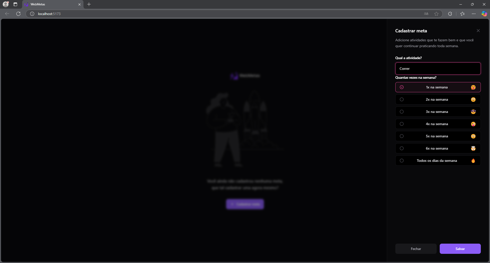
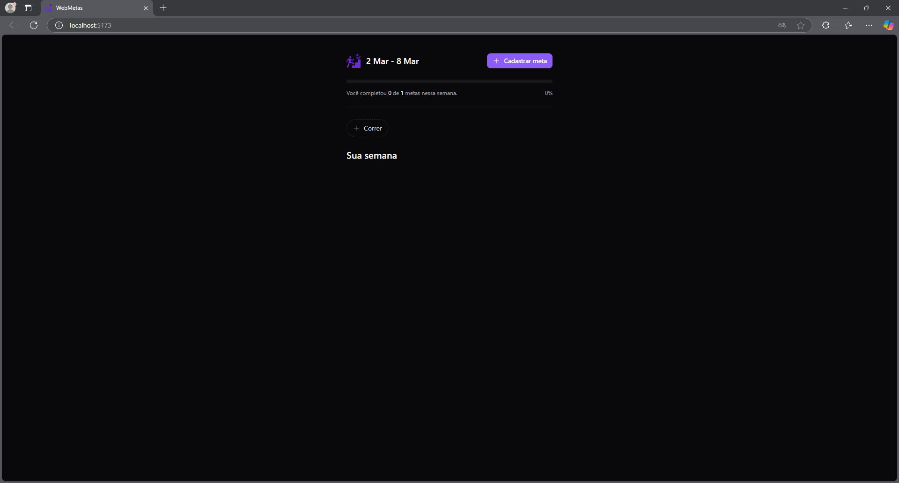
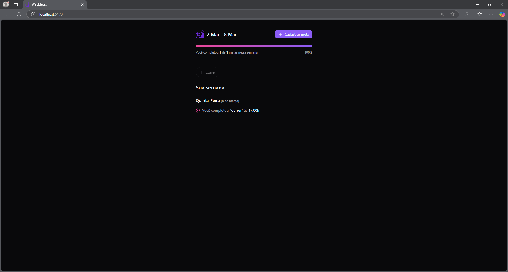

## Aplicativo de Gerenciamento de Metas (Frontend)

Este é o frontend de um aplicativo desenvolvido para o gerenciamento eficiente de metas, permitindo o cadastro de objetivos, definição de frequência semanal e monitoramento do progresso. A interface é moderna, intuitiva e otimizada para performance, proporcionando uma experiência fluida ao usuário.

## Características do Projeto:

✔ Cadastro de Metas – Interface para definir objetivos e a frequência com que devem ser realizados.
<br>
✔ Acompanhamento de Progresso – Barra de progresso que evolui conforme as metas são concluídas.
<br>
✔ Organização de Metas Concluídas – Visualização das metas finalizadas por dia, horário e semana.
<br>
✔ Desenvolvimento Moderno – Utilização de React, Tailwind CSS, TypeScript e outras tecnologias modernas.
<br>
✔ Interface Intuitiva – Design pensado para facilitar o uso e garantir a fluidez da navegação.
<br>
✔ Performance Otimizada – Código leve e rápido, com foco na eficiência de carregamento.

## Tecnologias Utilizadas

### Frontend

- **React** – Biblioteca JavaScript para construção de interfaces de usuário.

- **Tailwind CSS** – Framework CSS utilitário para estilização rápida e responsiva.

- **TypeScript** – Adiciona tipagem estática ao JavaScript para maior segurança e produtividade.

- **Vite** – Ferramenta de build rápida para desenvolvimento moderno.

- **React** Hook Form – Biblioteca para gerenciamento de formulários.

- **Zod** – Biblioteca para validação de esquemas de dados.

- **TanStack Query (React Query)** – Gerenciamento de estado e caching de dados.

- **Day.js** – Biblioteca para manipulação de datas.

- **Lucide React** – Ícones modernos e leves para a interface.

- **Radix UI** – Componentes acessíveis e personalizáveis.

### Ferramentas de Desenvolvimento

- **Biome** – Ferramenta para linting e formatação de código.

- **ESLint** – Linting para garantir a qualidade do código.

- **PostCSS** – Processamento de CSS moderno.

- **Autoprefixer** – Adiciona prefixos de vendor ao CSS.

## Como Rodar o Projeto Localmente

### Pré-requisitos

- Node.js (versão 18 ou superior)
- npm ou yarn (gerenciadores de pacotes)

### Passos

1. Clone o repositório:
   ```bash
   git clone https://github.com/JPerrut/MetasFront.git
   ```
2. Acesse a pasta do projeto:
   ```bash
   cd MetasFront
   ```
3. Instale as dependências:
   ```bash
   npm install
   ```
4. Inicie o servidor de desenvolvimento:
   ```bash
   npm run dev
   ```
5. Acesse o projeto no navegador:
   ```bash
   http://localhost:5173
   ```

## Imagens do Projeto

### Aqui estão algumas capturas de tela da aplicação em funcionamento:

### Tela Inicial:


### Tela de Cadastro de Metas:



### Tela de Acompanhamento de Progresso:



### Tela de Metas Concluídas:



## Contribuição

### Contribuições são bem-vindas! Siga os passos abaixo:

1. Faça um fork do projeto.
2. Crie uma branch para sua feature (`git checkout -b feature/nova-feature`).
3. Commit suas mudanças (`git commit -m 'Adiciona nova feature'`).
4. Faça push para a branch (`git push origin feature/nova-feature`).
5. Abra um Pull Request.

## Licença

Este projeto está licenciado sob a <a href="https://opensource.org/license/mit">MIT License</a>.

## Contato

### Se tiver dúvidas ou sugestões, entre em contato:

Nome: João Perrut <br>
Email: joaoperrutc@gmail.com <br>
Linkedin: https://www.linkedin.com/in/perrut/
